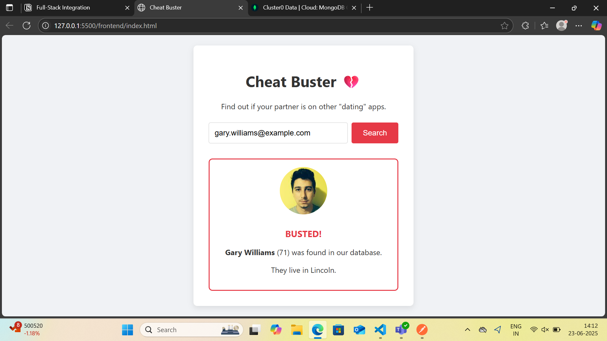
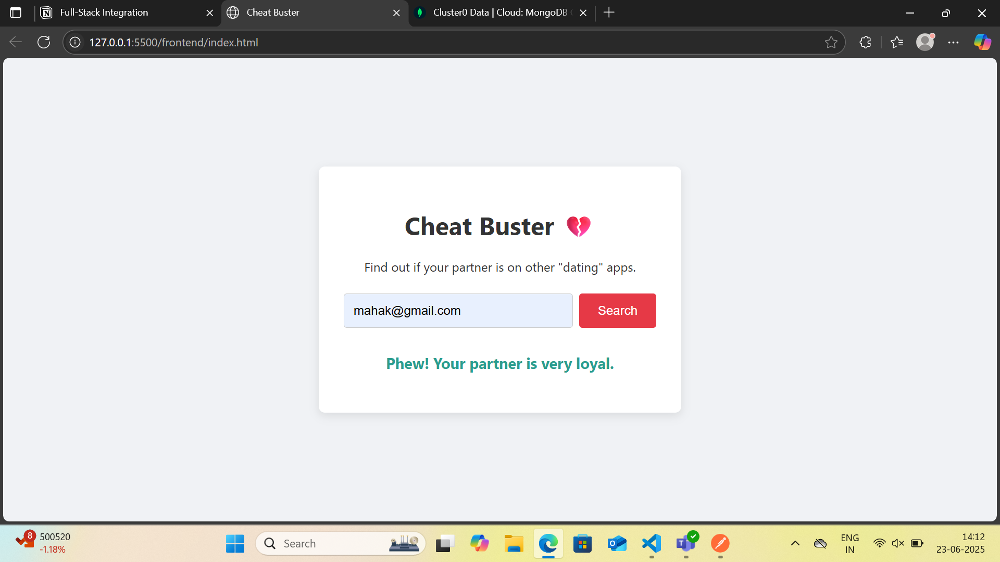

# Cheat Buster

Cheat Buster is a full stack web application that helps users find their partner's profiles. 

## Features

- Search for a partner's profile using email id
- User-friendly interface
- Sample API integration for demonstration

## Tech Stack

- **Frontend:** HTML, CSS, JavaScript, Axios (for API calls)
- **Backend:** Node.js, Express.js, Axios (for seeding)
- **Database:** MongoDB
- **API:** Sample dating app API

 ### Snapshots

